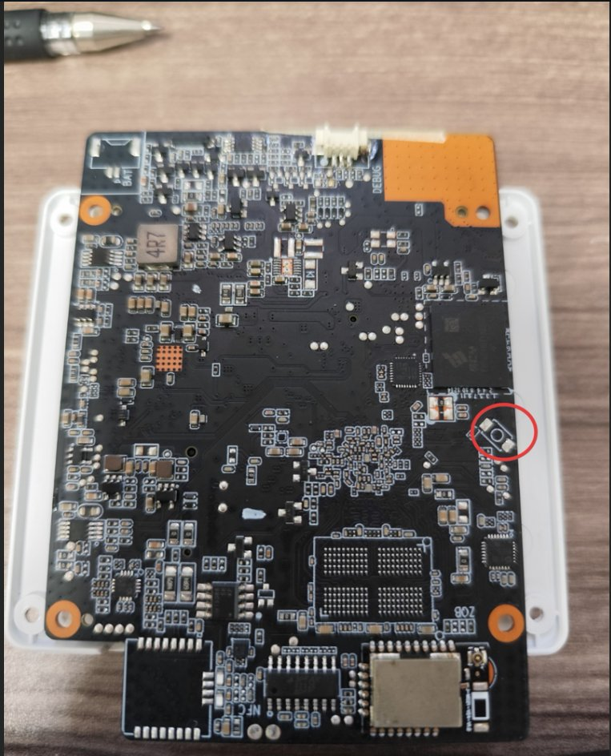

# U-Boot boot chain

The RK3576 boot ROM loads the boot chain from fixed raw offsets on the
eMMC/SD — there is no boot partition involved:

| Blob             | Sector | Byte offset | Contents                            |
| ---------------- | ------ | ----------- | ----------------------------------- |
| `idbloader.img`  | 64     | 32 KB       | Rockchip idblock: DDR init + SPL    |
| `u-boot-env.itb` | 16384  | 8 MB        | FIT: U-Boot + BL31 (ATF) + OP-TEE   |

The committed blobs are built from the vendor SDK's U-Boot
(`rk3576-linux6.1-20251118`, idblock v1.09.108, BL31 v1.20) with the
Nerves environment support added to the defconfig:
`CONFIG_ENV_IS_IN_MMC=y`, `CONFIG_ENV_OFFSET=0xF00000`,
`CONFIG_ENV_SIZE=0x20000`, `CONFIG_SYS_MMC_ENV_DEV=0`.

`u-boot.itb` (the stock SDK build without env support) is also committed,
for reference and recovery only — `fwup.conf` writes `u-boot-env.itb`.

## Boot and automatic revert

U-Boot runs the `nerves_init`/`nerves_boot` scripts from the shared
environment block and boots the active slot's `Image.<slot>` + dtb
directly. Automatic revert follows the standard Nerves model:

- **U-Boot:** with `nerves_fw_autovalidate=0`, new firmware boots once
  (`booted` 0→1) leaving `nerves_fw_validated=0`. If the next boot still
  sees `validated=0`, U-Boot boots the other slot.
- **Application:** calls `Nerves.Runtime.validate_firmware()` once healthy
  (sets `validated=1`), or the update reverts. See the app's
  `FirmwareValidator`.

If the saved environment is ever missing or corrupt, U-Boot ignores it
and its compiled-in default environment (distro boot) finds
`extlinux/extlinux.conf` on the FAT partition, so a bad environment
cannot brick the device.

## uboot.env — the shared firmware/boot environment

`uboot.env` is compiled into `uboot-env.bin` and written raw at 15 MB
(`UBOOT_ENV_OFFSET`, see `fwup_include/fwup-common.conf` and
`rootfs_overlay/etc/fw_env.config`). It is a single fw_env block shared by
three parties: U-Boot reads it to pick the boot slot, `nerves_runtime`/
`fwup` read and write the `nerves_fw_*` firmware metadata, and `boardid`
reads the serial number.

The vendor U-Boot injects runtime variables into the RAM environment at
every boot (`devtype`, `rkimg_bootdev`, and notably the bootcount-scheme
pair `upgrade_available`/`bootcount`), and any `saveenv` persists them.
`nerves_init` deletes the bootcount pair before its saveenvs: a persisted
`upgrade_available=0` makes `nerves_runtime` treat every upgraded boot as
already validated (it consults the standard U-Boot bootcount scheme
before `nerves_fw_validated`), silently disarming the automatic
validation and leaving the device one unattended reboot away from a
revert.

Two env variables are load-bearing beyond boot selection:
`stdout`/`stderr` must include `vidconsole` or U-Boot never probes the
display and the boot splash silently does not appear (the splash BMPs
and their generator live in `uboot/logo/`; they are packed with the
kernel dtb into the `resource` partition by `post-createfs.sh`). And
because a saved environment replaces U-Boot's built-in defaults
wholesale, removing any of the reproduced default variables in
`uboot.env` silently loses that behavior. Note: editing `uboot.env`
requires regenerating `uboot-env.bin` — Buildroot's host-uboot-tools
does NOT rebuild it automatically (clear its build dir or do a clean
system build).

## Rebuilding the blobs

`scripts/build-uboot.sh <sdk-dir>` rebuilds all three committed blobs
(`idbloader.img`, `u-boot.itb`, `u-boot-env.itb`) from the SDK's U-Boot
source in Docker (the vendor packing tools are x86-64 Linux binaries,
hence `--platform linux/amd64`). The build also produces
`rk3576_spl_loader_v*.bin` — the download loader for `rkdeveloptool db`
maskrom flashing/recovery; the matching build is committed here as
`rk3576_spl_loader_v1.09.108.bin` (Rockchip does not publish packed
RK3576 loaders in [rkbin](https://github.com/rockchip-linux/rkbin),
only the components).

## Recovery: loader mode and maskrom mode

Two USB recovery modes exist below the OS, reachable over the back USB-C
port with `rkdeveloptool` (or Rockchip's RKDevTool on Windows). Per the
manufacturer (ELC support):

> Connect the device to your PC via a data cable. Use a pin to press and
> hold the small hole next to the power button, then plug in the power
> supply. Keep holding until the upgrade tool detects the LOADER or
> Maskrom device, then click to start the upgrade. You can also
> short-circuit the mainboard to enter Maskrom mode.

- **Loader (rockusb) mode** — what we normally use. The recessed
  pin-hole next to the power button is the recovery button: hold it
  while applying power and the vendor loader enumerates as a `LOADER`
  USB device (releasing too early instead boots the on-flash OS or its
  recovery menu — power-cycle and retry, holding until `rkdeveloptool
  ld` sees the device). Works as long as the on-flash idbloader is
  intact. The loader is already running in this mode: use `wl`/`rd`
  directly — `db` fails with "The device does not support this
  operation!".
- **Maskrom mode** — the BootROM-level fallback when the flash
  bootloader itself is broken (true unbrick). The red circle below marks
  an UNPOPULATED button footprint on the main-board back (near the
  eMMC): no button is fitted, so entry means **shorting the two button
  pads together** (tweezers/wire) while applying power. In maskrom the
  ROM waits for code over USB:
  `rkdeveloptool db uboot/rk3576_spl_loader_v1.09.108.bin` (committed
  in this directory), then `rkdeveloptool wl <sector> <image>` /
  `rkdeveloptool rd` to reboot. Note maskrom requires opening the
  86-box module bay to reach the board back.

Useful `rkdeveloptool` commands: `ld` (list devices + mode), `db <loader>`
(bootstrap maskrom), `wl <sector> <file>` (write LBA), `rd` (reboot).

## Licensing of the committed blobs

`u-boot.itb`/`u-boot-env.itb` contain U-Boot (GPL-2.0, source:
Rockchip's vendor U-Boot tree in the SDK — rebuild instructions above)
packed together with proprietary Rockchip/ARM components: the DDR-init
and SPL blobs from rkbin (Rockchip's redistributable binary
repository), ARM Trusted Firmware BL31, and OP-TEE BL32. `idbloader.img`
and `rk3576_spl_loader_v1.09.108.bin` are packed from the same rkbin
components. Rockchip distributes these blobs publicly for use with
Rockchip SoCs; they are not covered by this repository's GPL licensing.
